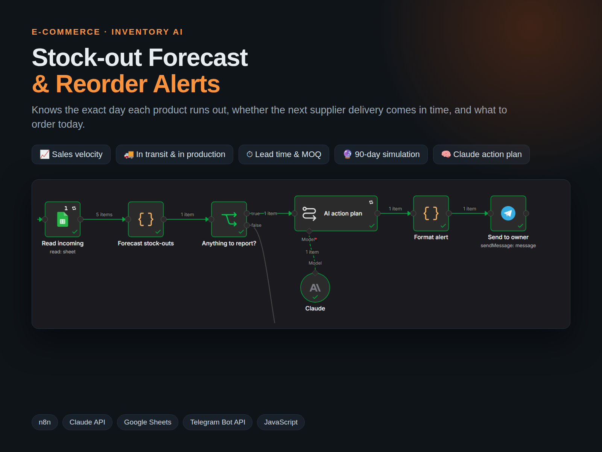
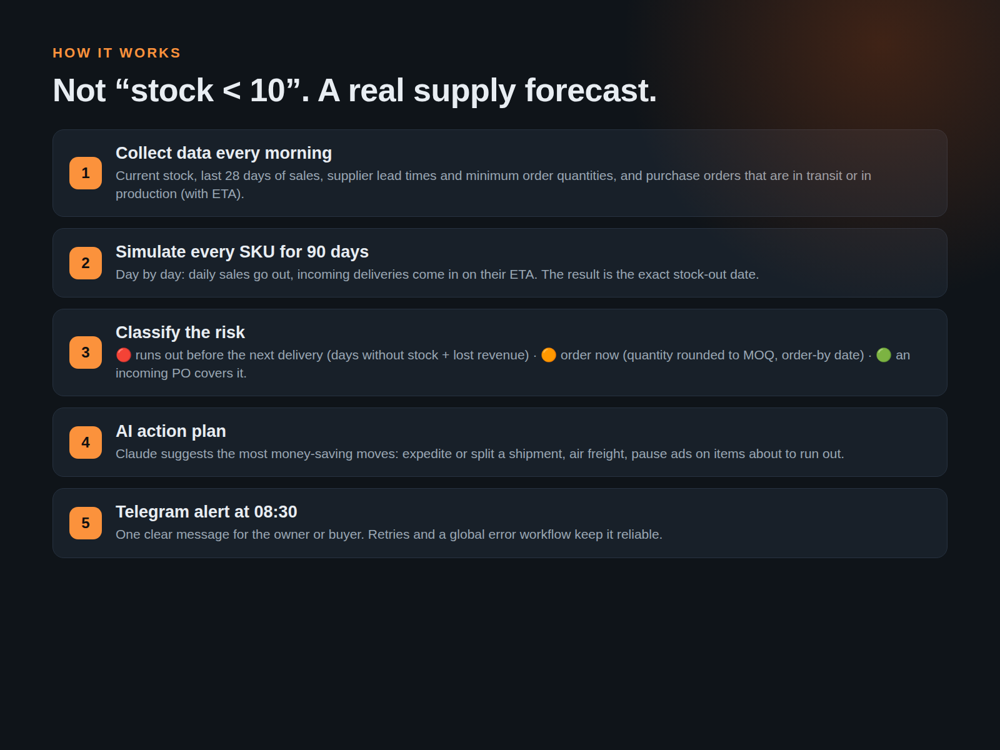
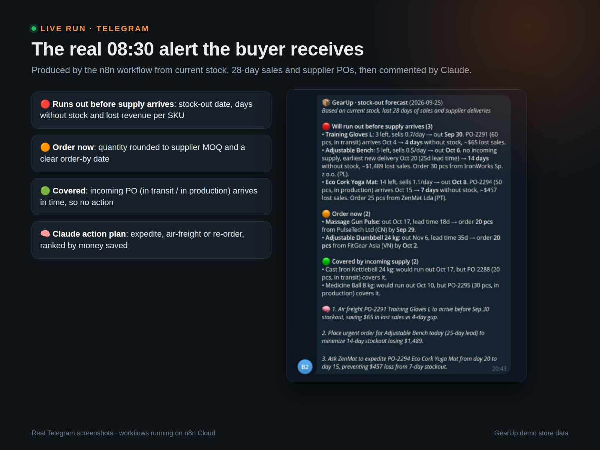
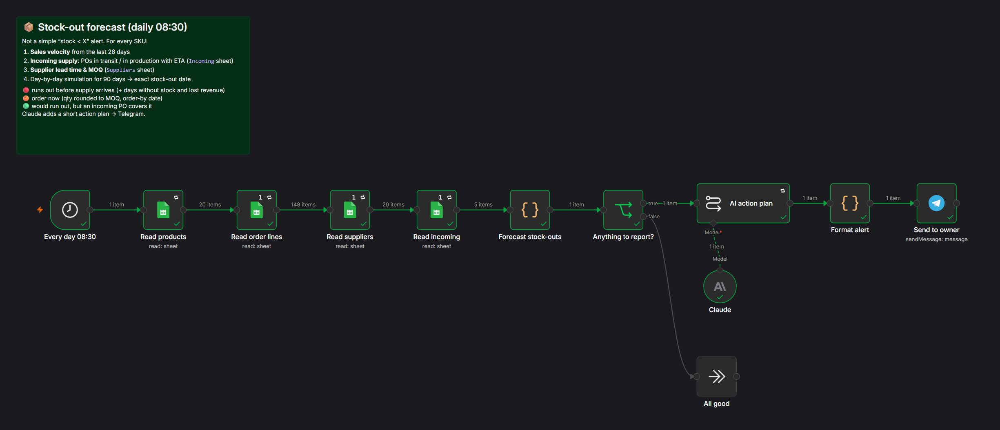
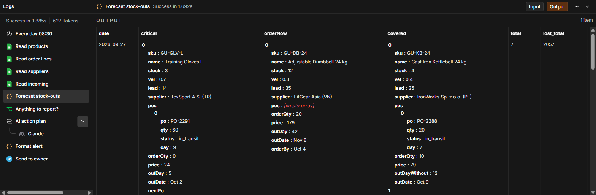

# Stock-out Forecast & Reorder Alerts | n8n + Claude AI

**Role:** AI Automation Engineer — design, build & testing
**Project type:** Inventory planning · E-commerce operations
**Tools:** n8n · Claude (Anthropic API) · Google Sheets · Telegram Bot API · JavaScript

## The Challenge

Simple "stock below X" alerts come too late or too often. They ignore how fast each product sells, how long the supplier needs, and what is already on the way. Owners find out about a stock-out when customers can't buy.

## The Solution

Google Sheets (stock, sales, suppliers, purchase orders) → n8n → day-by-day forecast in code → risk classification → Claude action plan → Telegram

I built an inventory forecasting workflow for an e-commerce store that predicts the exact day each product runs out and whether the next supplier delivery arrives in time. Every morning n8n combines current stock, 28-day sales velocity, purchase orders in transit or in production (with ETA), supplier lead times and MOQ, simulates 90 days per SKU, and sends a Telegram alert: what runs out before supply arrives, what to order today, and how much. Claude adds a short action plan.

## Key Features

- Sales velocity per SKU from the last 28 days
- Incoming supply: POs in transit / in production with ETA
- Supplier lead time and minimum order quantity
- 90-day simulation → exact stock-out date per product
- 🔴 runs out before supply arrives: days without stock + estimated lost revenue
- 🟠 order now: quantity rounded to MOQ and an order-by date
- 🟢 an incoming PO covers the risk
- Works with any date format / spreadsheet locale
- Retries and a global error workflow

## Canvas

## Deliverables

n8n workflow · Google Sheets data model (products, suppliers, incoming POs) · Telegram alerts · setup guide

---

*Note: built as a showcase project on a realistic fictional store dataset ("GearUp"). The data source can be swapped for Shopify, WooCommerce, Wildberries/Ozon or an ERP via API.*

Workflow file: [`../workflows/06_stockout_forecast.json`](../workflows/06_stockout_forecast.json)
