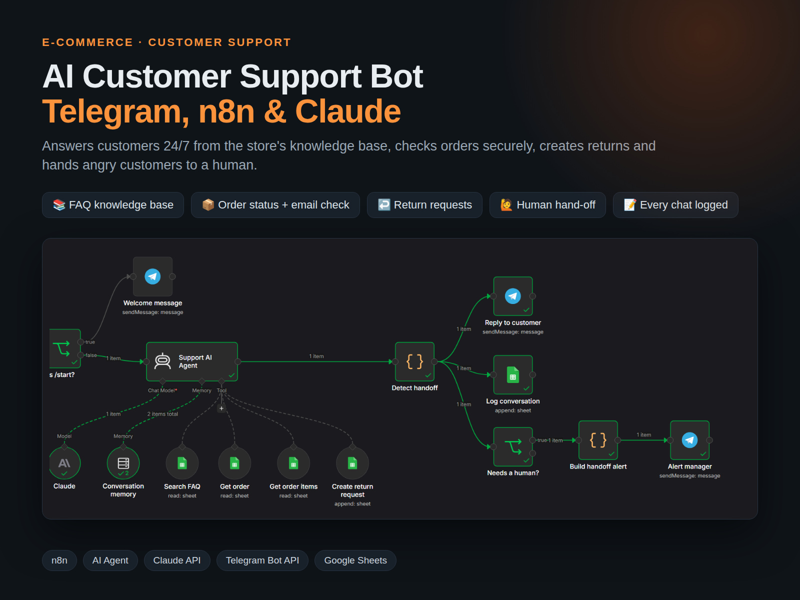
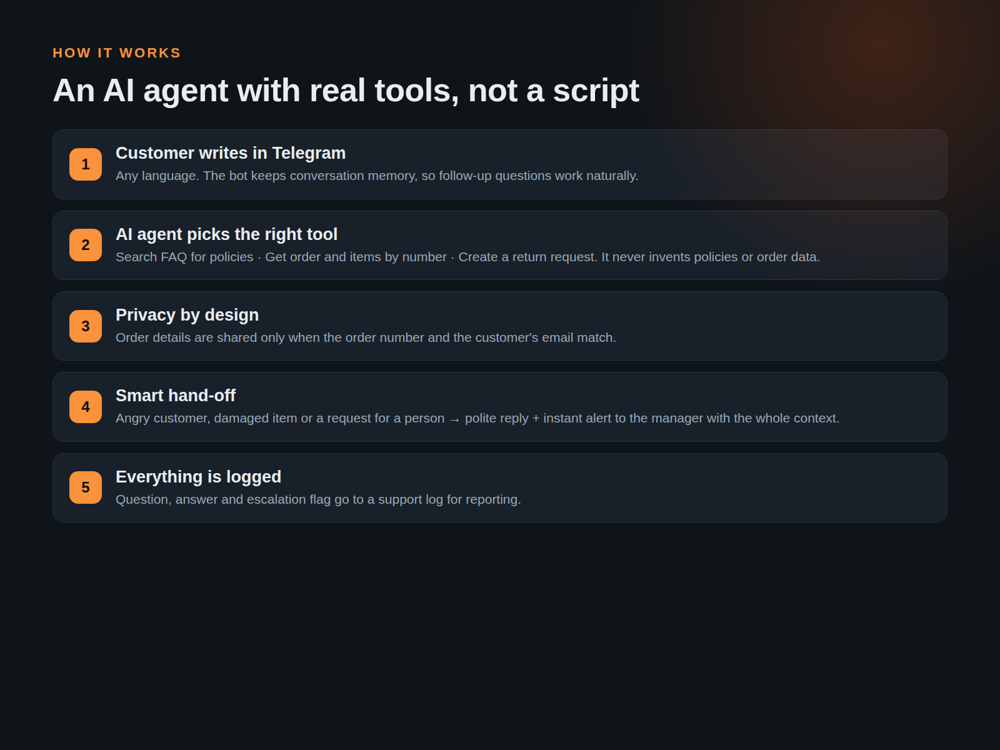
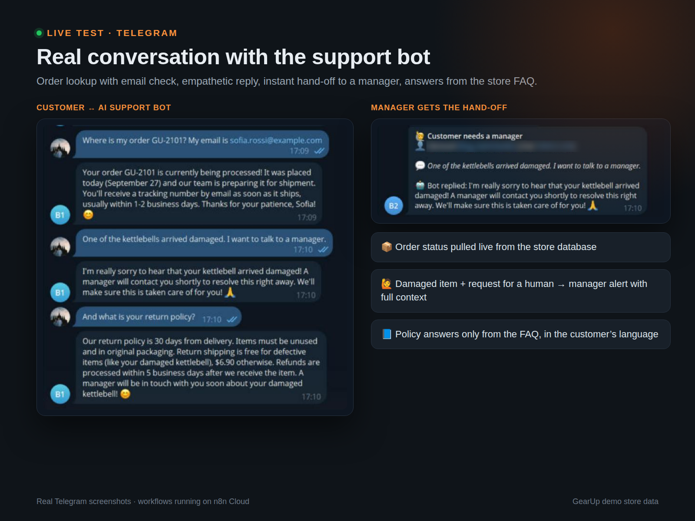
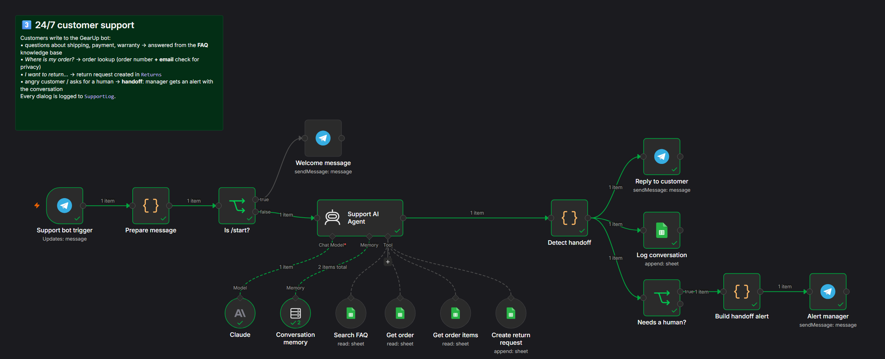

# AI Customer Support Bot | Telegram, n8n & Claude

**Role:** AI Automation Engineer — design, build & testing
**Project type:** Customer support automation · E-commerce
**Tools:** n8n AI Agent · Claude (Anthropic API) · Telegram Bot API · Google Sheets

## The Challenge

Most support messages are the same questions: shipping, returns, "where is my order". Answering them manually is slow, and customers expect replies at night and on weekends.

## The Solution

Customer (Telegram) → n8n AI Agent with memory → tools: Search FAQ · Get order · Get order items · Create return → reply + log → hand-off to a manager when needed

I built a 24/7 AI support assistant for an online store in Telegram. An n8n AI agent (Claude + conversation memory) answers policy questions only from the store's FAQ, looks up order status after verifying the customer's email, creates return requests, and hands angry customers or damaged-item cases to a manager with full context. Every conversation is logged for reporting.

## Key Features

- Answers only from the knowledge base, never invents policies
- Order lookup with order number + email verification
- Return requests created automatically (30-day rule checked)
- Escalation: request for a human, angry customer, damaged item → manager alert with context
- Replies in the customer's language
- Full conversation log

## Canvas

## Deliverables

n8n workflow · FAQ knowledge base · support log · Telegram bot · setup guide

---

*Note: built as a showcase project on a realistic fictional store dataset ("GearUp").*

Workflow file: [`../workflows/03_customer_support_bot.json`](../workflows/03_customer_support_bot.json)
