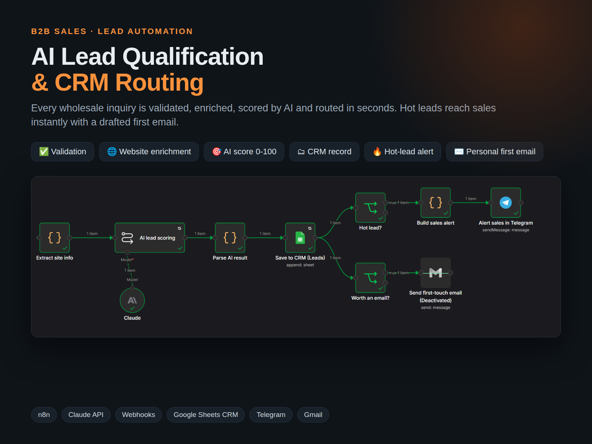
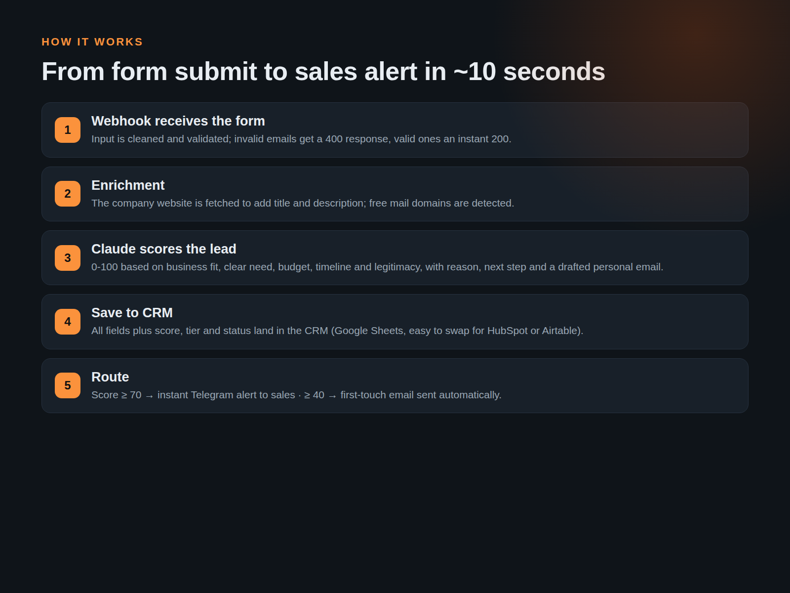
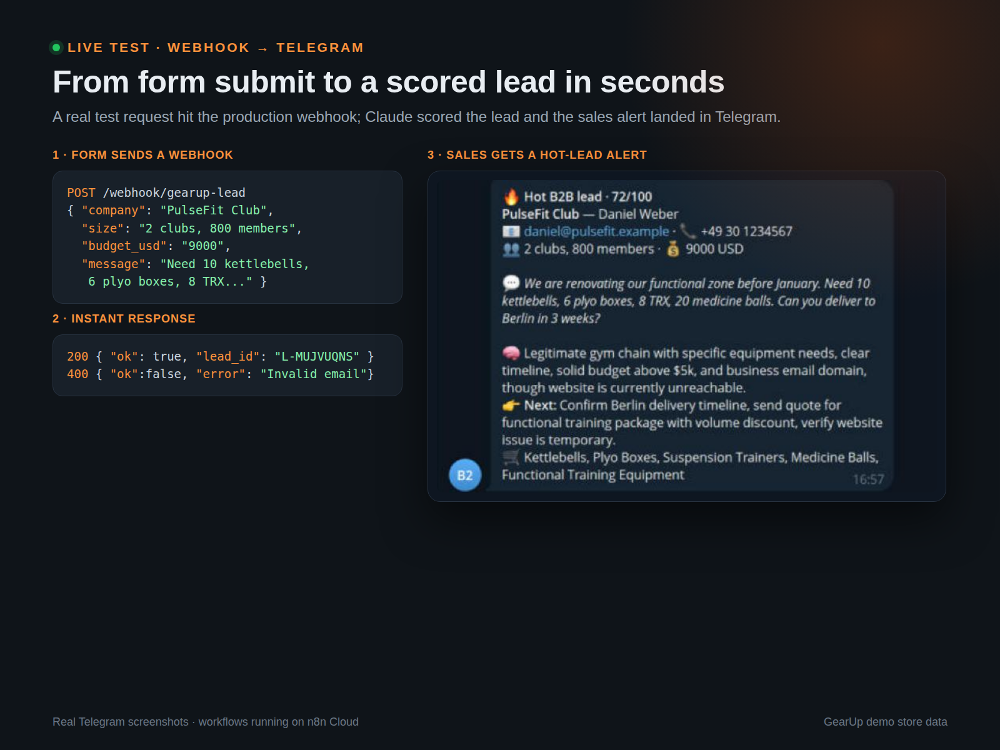
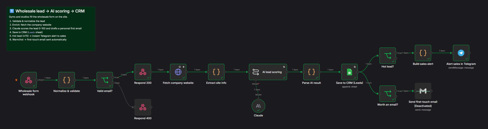
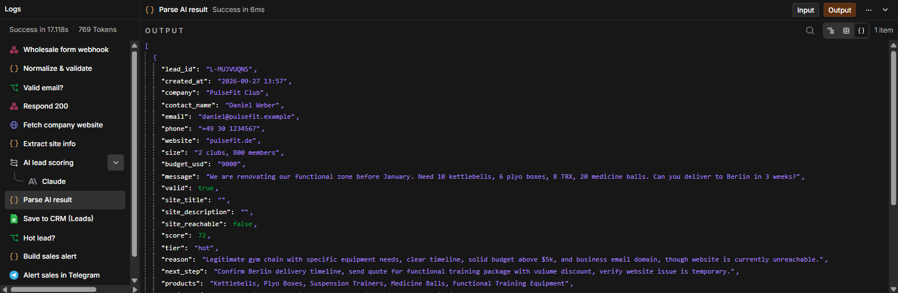

# AI Lead Qualification & CRM Routing | n8n + Claude AI

**Role:** AI Automation Engineer — design, build & testing
**Project type:** Sales automation · B2B lead management
**Tools:** n8n · Claude (Anthropic API) · Webhooks · Google Sheets CRM · Telegram · Gmail

## The Challenge

Wholesale inquiries arrive mixed with spam and retail questions. Sales reps lose hot leads because they reply too late or spend time on the wrong ones.

## The Solution

Form webhook → validation → website enrichment → Claude scoring → CRM → hot lead: Telegram alert · warm lead: first email

I built a B2B lead intake workflow for a fitness-equipment wholesaler. A webhook receives the form, n8n validates and enriches the lead from the company website, and Claude scores it 0-100 with a reason, next step and a drafted personal email. The lead is saved to the CRM, hot leads trigger an instant Telegram alert to sales, and warm leads get the first-touch email automatically. Response time goes from hours to seconds.

## Key Features

- Input validation with proper webhook responses (200/400)
- Company website enrichment (title, description)
- AI score 0-100 with tier, reason and next step
- Drafted personal first email in the lead's language
- CRM record for every lead (easy to swap for HubSpot or Airtable)
- Retries and error workflow

## Canvas

## Deliverables

n8n workflow · CRM structure · Telegram alerts · email automation · setup guide

---

*Note: built as a showcase project on a realistic fictional store dataset ("GearUp").*

Workflow file: [`../workflows/01_b2b_lead_qualification.json`](../workflows/01_b2b_lead_qualification.json)
