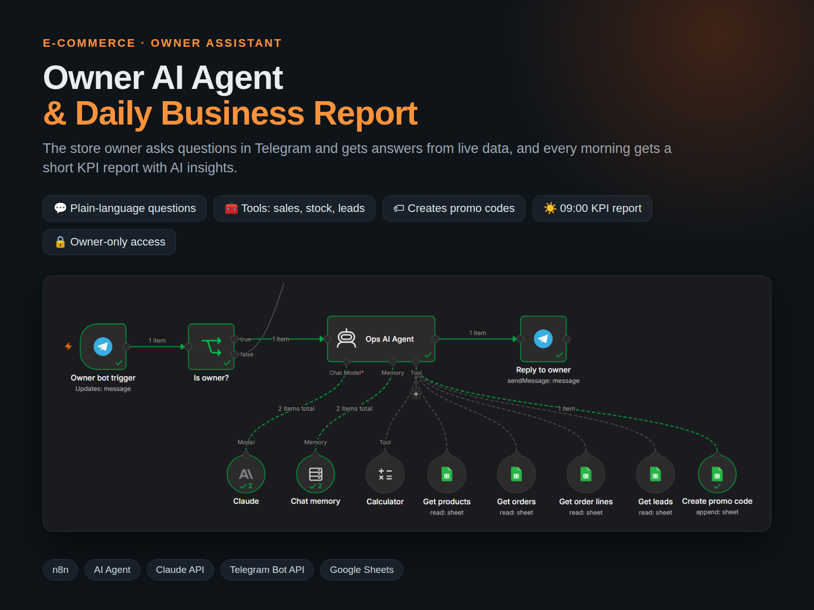
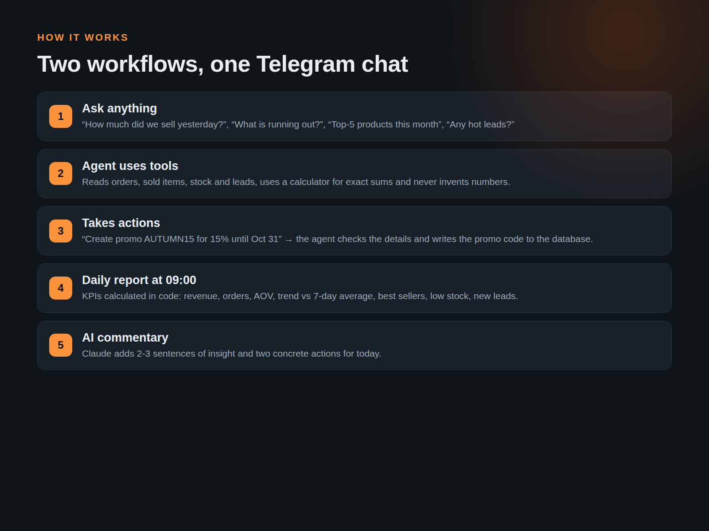
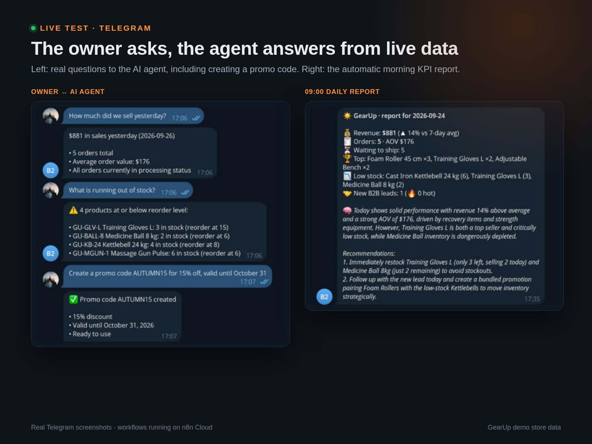
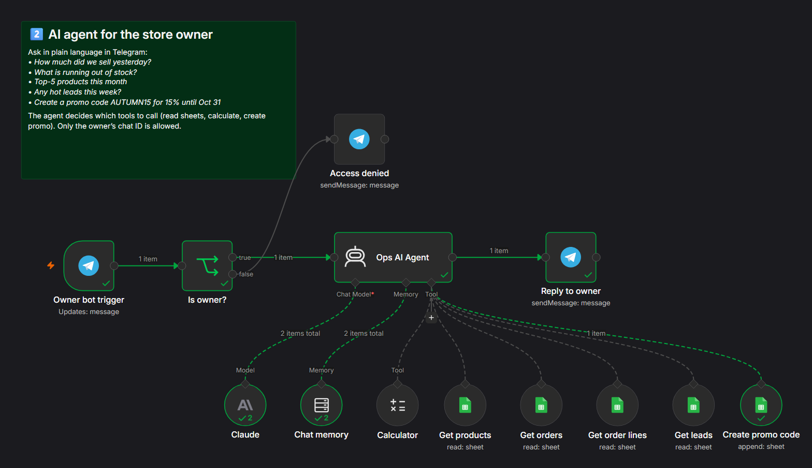
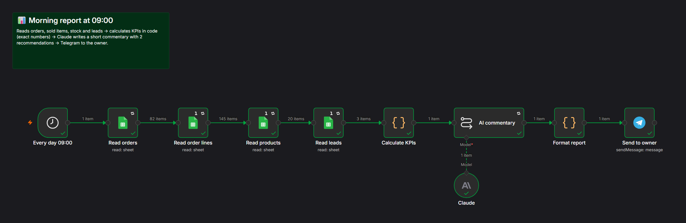
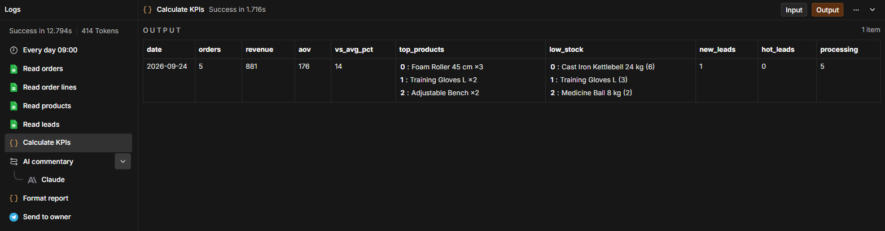

# Owner AI Agent & Daily Business Report | Telegram, n8n & Claude

**Role:** AI Automation Engineer — design, build & testing
**Project type:** Business intelligence · AI assistant
**Tools:** n8n AI Agent · Claude (Anthropic API) · Telegram Bot API · Google Sheets · JavaScript

## The Challenge

Owners of small stores spend time opening dashboards and spreadsheets just to answer simple questions, and nobody summarizes yesterday's numbers for them.

## The Solution

Owner (Telegram) → AI agent with tools → answer or action · Schedule 09:00 → KPIs in code → Claude commentary → Telegram

I built an AI operations assistant for an online store owner. In Telegram the owner asks in plain language, e.g. "How much did we sell yesterday?", "What is running out?", "Create a promo AUTUMN15 for 15%", and an n8n AI agent answers from live data using tools (orders, stock, leads, calculator, promo creation). Every morning at 09:00 a second workflow sends a KPI report with Claude's insights and two actions for the day.

## Key Features

- Plain-language questions about sales, stock, best sellers and leads
- Exact numbers: data from tools + calculator, no guessing
- Actions: creates promo codes after confirming details
- Owner-only access by Telegram chat ID
- Morning report: revenue, orders, AOV, trend vs 7-day average, top products, low stock, new leads
- AI insight + 2 concrete recommendations

## Canvas

## Deliverables

2 n8n workflows · Telegram bot · report template · setup guide

---

*Note: built as a showcase project on a realistic fictional store dataset ("GearUp").*

Workflow files: [`../workflows/02_owner_ops_ai_agent.json`](../workflows/02_owner_ops_ai_agent.json) · [`../workflows/05_daily_ai_report.json`](../workflows/05_daily_ai_report.json)
