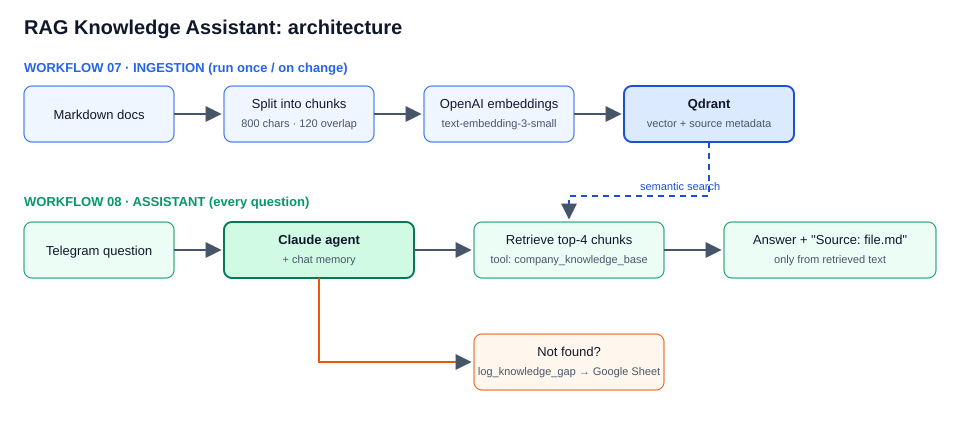

# RAG Knowledge Assistant with Source Citations | n8n, Claude, Qdrant

**Role:** AI Automation Engineer — design & build
**Project type:** Internal knowledge assistant · RAG (retrieval-augmented generation)
**Tools:** n8n AI Agent · Claude (Anthropic API) · Qdrant vector store · OpenAI embeddings · Telegram Bot API · Google Sheets

## The Challenge

Policies live in scattered documents: shipping rules, returns and warranty, wholesale terms, internal staff rules. Support agents and owners waste time searching them, and a general-purpose chatbot invents answers that sound right but contradict the real policy.

## The Solution

Two connected n8n workflows:

1. **Ingestion** (`07_rag_knowledge_ingest.json`): documents → download → split into ~800-character chunks with overlap → embeddings → Qdrant, with the source file name stored as metadata.
2. **Assistant** (`08_rag_knowledge_assistant.json`): Telegram question → Claude agent with a `company_knowledge_base` retrieval tool → grounded answer with a `Source:` line → fallback that **logs every unanswered question** to a `KB_Gaps` sheet.

## Key Features

- Answers **only from retrieved text**; the system prompt forbids guessing and requires a source line
- Source file stored as chunk metadata, so every answer is verifiable
- **Knowledge-gap log**: questions the base could not answer become a to-do list of missing documents
- Per-chat conversation memory (follow-up questions work)
- Language-agnostic: English documents, questions in any language, exact numbers and currencies preserved
- Swap-ready: the document source (here raw Markdown files in `knowledge-base/`) can be Google Drive, Notion, Confluence or S3; Qdrant can be replaced by Supabase/pgvector or Pinecone

## Sample knowledge base

Four demo documents for the fictional store GearUp are included in [`../knowledge-base/`](../knowledge-base/): shipping, returns and warranty, wholesale terms, internal staff FAQ. Example questions you can ask:

- *How long do I have to return a damaged item, and who pays for shipping?*
- *What discount does a gym get on a 6,000 EUR order?*
- *Can a refund of 450 EUR be confirmed to the customer right away?* (answer: no, manager approval is required above 300 EUR)
- *Do you ship to Japan?* (not in the knowledge base → the assistant says so and logs the gap)

## Setup (about 20 minutes)

1. Run Qdrant (`docker run -p 6333:6333 qdrant/qdrant`) or create a free Qdrant Cloud cluster; add the Qdrant, OpenAI, Anthropic, Telegram and Google Sheets credentials in n8n.
2. Import both workflows from [`../workflows/`](../workflows/).
3. In **07**, adjust the base URL if you host the documents elsewhere, then run **Start ingestion** once.
4. In **08**, set your Google Sheet ID (create a `KB_Gaps` tab with columns `question`, `asked_at`, `asked_by`) and activate the workflow.

## Deliverables

2 n8n workflows · sample knowledge base · setup guide

---

*Note: showcase project on a fictional store dataset ("GearUp"). Both workflows import into n8n 2.41 and pass node-definition checks (types, versions, parameters). They have not been run end-to-end against a live Qdrant/OpenAI account: connect your own credentials to run them.*

Workflow files: [`../workflows/07_rag_knowledge_ingest.json`](../workflows/07_rag_knowledge_ingest.json) · [`../workflows/08_rag_knowledge_assistant.json`](../workflows/08_rag_knowledge_assistant.json)
